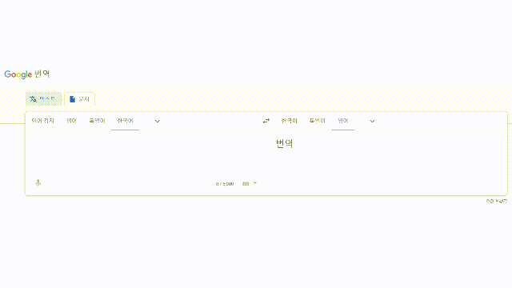

# 프로젝트 1 동기
우리는 번역기에서 번역된 결과를 재번역해볼 때 올바르지 않는 결과를 얻는 경우들을 접할 수 있습니다.
   

   
위 사진을 보면 "동해물과 백두산이 마르고 닳도록"을 영어로 번역한 후 다시 한국어로 재번역했을 때 "동해와 백두산의 물이 마를 때까지"라는 엉뚱한 번역 결과가 나오는 것을 확인할 수 있습니다. 이것이 제대로 된 번역은 아니지만 우리를 웃음 짓게 만드는 재미있는 번역이라고 할 수 있습니다.
   
저희는 여기서 아이디어를 얻어 번역한 결과를 재번역해주는 서비스를 만들어 보고자 하였습니다.

# 프로젝트 1 사용 기술 및 흐름
프론트엔드는 HTML과 CSS, 백엔드는 python 기반의 웹프레임워크인 장고(django)를 사용하였습니다. 번역 기능은 googletrans라는 오픈소스 라이브러리를 사용하였습니다.
   
프로젝트 1 서비스의 전체적인 작동 흐름은 다음과 같습니다.
   
웹페이지 접속 → 사용자가 번역할 문장 입력 → 입력 문장을 HTML form 태그를 이용해 POST 방식으로 전송 → 전송된 문장을 장고 기능을 통해 받아서 저장 (views.py) → googletrans 라이브러리를 이용해 번역 진행 → 장고에서 HTML 파일 렌더 시 번역된 결과를 인자로 HTML 파일에 전달해줌 → 전달받은 값을 화면에 출력해줌

# 프로젝트 1 어려웠던 점
사용자가 입력한 문장과 번역된 결과를 프론트엔드와 백엔드 사이에서 주고받을 때 처음에는 Axios라는 라이브러리를 사용하고자 시도하였습니다. 그러나 여러 자료를 찾아보며 Axios를 사용하기 쉽지 않다는 것을 깨달았습니다.
   
Axios 대신 데이터를 주고받을 수 있는 방법을 고민하던 중 HTML form 태그를 이용해 전송한 데이터를 장고를 통해 받을 수 있다는 것, 장고가 HTML 파일을 렌더할 때 파이썬의 데이터를 HTML로 넘길 수 있다는 것을 알게 되었습니다. 따라서 Axios를 사용하지 않고 장고 기능을 이용하여 데이터를 주고받는 것으로 결정하였습니다.

# 프로젝트 1 완성
