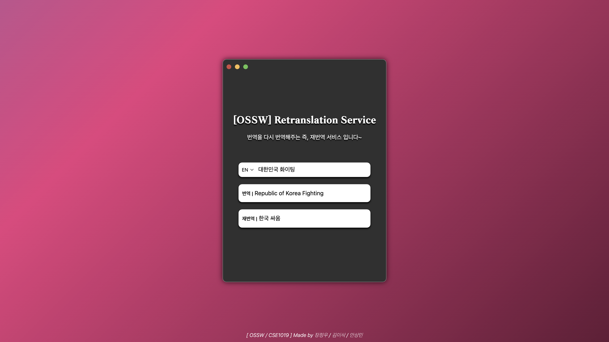

# OSSW 8조 팀 프로젝트

![test][test]

> 오픈소스SW기초(CSE1019) 과목에서 진행한 팀프로젝트 입니다.  
> 이 프로젝트는 엉뚱하고 쓸데없어 보이지만, 그렇기에 사용자들이 재미있게 사용하기를 바라는 마음으로 제작된 프로젝트 입니다.

## 사용 예제

### Project #1 - Retranslation Service

> 번역한 문장을 다시 재번역 해주는 서비스 입니다.



### Project #2 - Steam Sale

> 스팀 게임사이의 할인 정보를 불러와 주는 서비스 입니다.


## 실행 전 요구사항

파일을 실행하기 전 설치해야할 사항들 입니다.

이 프로젝트는 다음과 같은 외부 라이브러리를 사용하고 있습니다.

- [googletrans](https://pypi.org/project/googletrans/)
- [requests](https://pypi.org/project/requests/)
- [requests-cache](https://pypi.org/project/requests-cache/)

```
pip3 install
pip3 install googletrans requests requests-cache
```

## 실행 방법

1. 우선 프로젝트를 다운로드 합니다.

```
git clone [download-link]
```

2. 터미널에서 해당 프로젝트의 manage.py가 있는 폴더로 이동해 줍니다.

```
// Project #1 실행 시
cd OSSW_Project_1/project_TS/

// Project #2 실행 시
cd OSSW_Project_2/project_TS/
```

3. 해당 폴더의 위치에서 manage.py를 실행시켜 줍니다.

```
python3 manage.py runserver
```
## 작업내역(Insight)
[Github Insight](https://github.com/jeongwoo903/OSSW_Project/network)
 참고

## 라이센스(License)

> NOTICE 폴더 참고

[test]: https://img.shields.io/badge/npm-%3E%3D8.10.0-red
